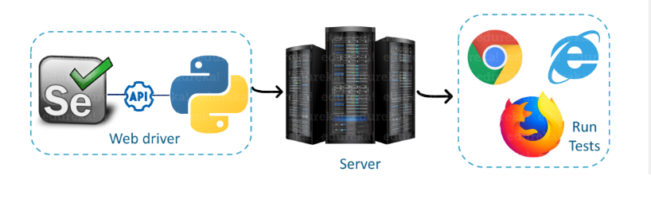
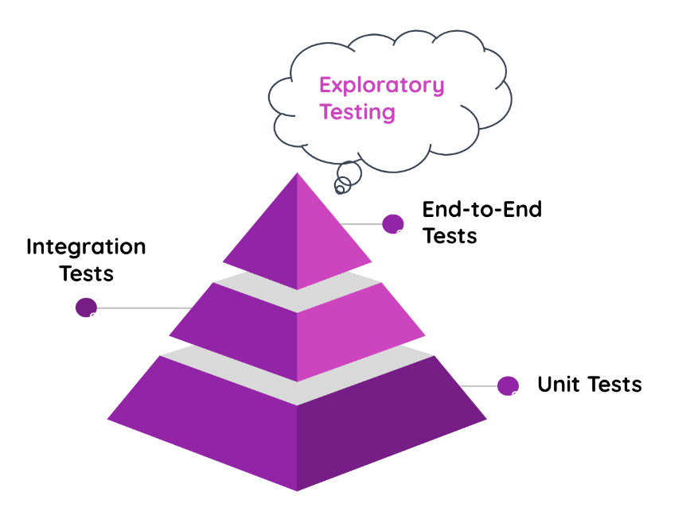
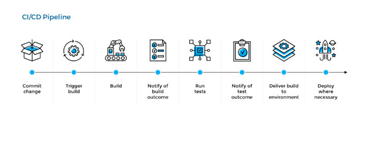
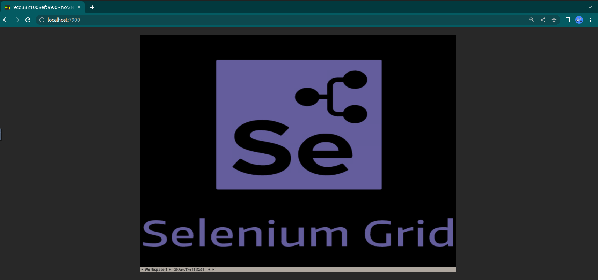
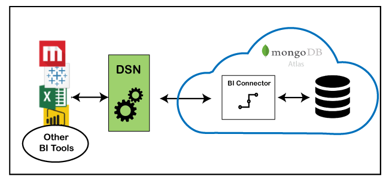
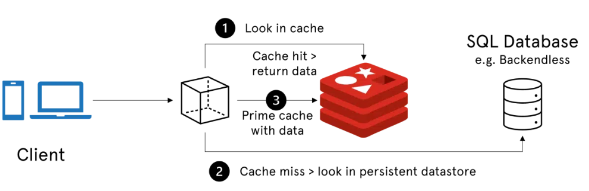

# End-to-End Automated Software Testing by Selenium

Automated testing is a standard modern software development practice.


###### Picture [source](https://www.edureka.co/blog/selenium-using-python/ "source")

<p>
<br>
 The best teams and companies use automated tests. CI/CD is dependent on automated tests and is critical to helping the best teams ship reliable and robust software to their customers.
 <br>
</p>

---

## Table of Contents

<!--ts-->

- 1- [Introduction](#Introduction)

- 2- [What is the Automated Testing?](#What-is-Automated-Testing?)
  - 2-1- [Process of E2E Testing](#Process-of-E2E-Testing)
- 3- [Selenium](#Selenium)
  - 3-1- [E2E testing using Selenium](#E2E-testing-using-Selenium)
  - 3-2- [Selenium Integrated With CI/CD Pipelines](#Selenium-Integrated-With-CI/CD-Pipelines)
  - 3-3- [E2E test using Pytest](#E2E-test-using-Pytest)
  - 3-4- [E2E Tests with Selenium and Docker](#E2E-Tests-with-Selenium-and-Docker)
  - 3-5- [Selenium WebDriver and Docker container](#Selenium-WebDriver-and-Docker-container)
  - 3-6 [Using Pytest Fixtures](#Using-Pytest-Fixtures)
  - 3-7 [Using PyMongoDB](#Using-PyMongoDB)
- 4- [Fake data injection by MongoDB](#Fake-data-injection-by-MongoDB)

- 5- [Using Redis](#Using-Redis)
- 6- [Requirements and Installation](#Requirements-and-Installation)

- 7- [How to Run](#How-to-Run)

- 8- [Debugging](#Debugging)

- 9- [Results](#Results)

- 10- [Troubleshooting](#TroubleShooting)

- 11- [Conclusion](#Conclusion)

- 12- [Future Work and improvement](#Future-Work-and-improvement)
<!--te-->

---

<a name="Introduction"></a>

## 1- Introduction

The goal of this E2E-Test is to find bugs in the web application that arise as a result of the correlation between multiple components.
Eventually, in this project, we consider the following tasks for an HMI page as follows:

&check; Login Page test

&check; Invalid username and/or password

&check; Check empty username and password

&check; Checking driver components

&check; Checking of error messages

&check; Injecting Fake data from MongoDB and check the credentials

&check; Deleting the keys from the cache memory by Redis

---

<a name="What-is-Automated-Testing?"></a>

## 2- What is Automated Testing?

Automated testing involves using software tools to automate the process of reviewing and validating a software product, which was previously done manually by humans. It has been commonly included in modern agile and DevOps software projects from the beginning.

<p align="center">

</p>

###### Picture [source](https://www.atlassian.com/devops/devops-tools/test-automation "source")

<br>

Testing practices typically involve the following stages:

- **Unit testing:** validates individual units of code, such as a function, so it works as expected.
- **Integration testing:** ensures several pieces of code can work together without unintended consequences.
- **End-to-End testing:** validates that the application meets the user’s expectations.
- **Exploratory testing:** takes an unstructured approach to reviewing numerous areas of an application from the user perspective, to uncover functional or visual issues.

The different types of testing are often visualized as a pyramid. As you climb up the pyramid, the number of tests for each kind decreases, and the cost of creating and running tests increases.

<br>

<a name="Process of End-to-End Testing"></a>

### **2-1- Process of End-to-End Testing**

End-to-end testing involves mainly the following tasks:

- Examination of end-to-end testing requirements.
- There are descriptions of each system's roles and duties.
- Techniques and standards for testing.
- Configuration of hardware and software for the test environment.
- Describe each system and any related processes.
- Data on each system's inputs and outputs.
- Fully developed test case design and requirements tracking

<br>

###### Read more [link](https://www.lambdatest.com/learning-hub/end-to-end-testing/ "link")

---

<a name="Selenium"></a>

## **3- Selenium**

<p>
Selenium is an open-source testing tool used for web application testing. It allows testers to write automated tests in various programming languages to test the functionality of web applications. Selenium tests can be run on many different browsers and operating systems. Selenium consists of three major components: Selenium IDE, Selenium WebDriver and Selenium Grid.</p>

<p align="center">

</p>

###### Picture [source](https://www.fita.in/selenium-tutorial/ "source")

<br>

- **Selenium IDE** It is a Firefox add-on that enables testers to record and playback the recorded automated tests.
- **Selenium WebDriver** is an open-source tool used for automating web browser interaction from a user perspective. With Selenium WebDriver, you can write tests that simulate user interactions with a web application.
- **Selenium Grid**: It is a part of the overall Selenium testing suite that allows you to distribute your tests across multiple machines or virtual machines (VMs). This enables you to test parallelly on various devices or VMs, allowing you to scale your test automation quickly.

- **Selenium Remote Control**: Selenium RC allows testers to write automated web application UI tests in any of the supported programming languages. It also involves an HTTP proxy server which enables the browser to believe that the web application being tested comes from the domain provided by a proxy server.

The Selenium framework uses the WebDriver's language-neutral protocols to automate testing steps. In other words, the WebDriver is the bridge between the Selenium framework and the end browser over which the test is being executed.

<br>

<a name="E2E testing using Selenium"></a>

### **3-1- E2E testing using Selenium**

When starting with automation, many testers start their automation journey with a search for test automation frameworks. Selenium testing is a popular choice because it’s free and has a large user community.

Selenium consists of Selenium Webdriver, their primary web-based automation tool, Selenium IDE, a record-and-playback tool, and Selenium Grid, a parallel testing tool. Combined, these tools allow you to automate anything that goes on in the browser, using a code-based approach.

<br>

<a name="Selenium Integrated With CI/CD Pipelines"></a>

### **3-2- Selenium Integrated With CI/CD Pipelines**

Continuous Integration & Continuous Delivery demand for rapid and frequent delivery of a build's new releases. Now imagine yourself being in charge of ensuring cross-browser compatibility of your web app manually after every build is passed through your CI/CD pipelines. We won't have to tell you how much bandwidth it might cost. Not to forget the probability of human error while doing so. With Selenium, there is a smarter way!

<p align="center">

</p>

###### Picture [source](https://www.plutora.com/blog/understanding-ci-cd-pipeline "source")

<br>

Using the Selenium tool for browser automation, the team doesn't have to wait around for iterations running their course. CI engines keep each team member informed of configuration, infrastructure, changes in code, and errors. This way, the team can catch deployment failures, if any, at an early stage.

Selenium automation can help you with performance, functional, and compatibility testing that is recurring in nature. It also facilitates quick debugging by giving almost instant feedback to the developers.

##### Read more [link](https://www.simplilearn.com/tutorials/selenium-tutorial/selenium-automation-testing "link")

<br>

<a name="E2E test using Pytest"></a>

## **3-3- E2E test using Pytest**

Pytest is a popular Python testing framework, primarily used for unit testing. It is open-source and the project is hosted on GitHub. pytest framework can be used to write simple unit tests as well as complex functional tests.
A test can be broken down into four steps:

**1- Arrange:** Preparing everything for our test such as preparing objects, starting/killing services, defining a URL to query, etc.

**2- Act:** A singular, state-changing action that kicks off the behavior we want to test.

**3- Assert:** Taking the measurement/observation and applying our judgment to it. If something should be green, we’d say assert thing == "green".

**4- Cleanup:** This is where the test picks up after itself, so other tests aren’t being accidentally influenced by it.

##### Read more [link](https://www.lambdatest.com/blog/selenium-python-pytest-testing-tutorial/ "link")

---

<a name="E2E Tests with Selenium and Docker"></a>

## **3-4- E2E Tests with Selenium and Docker**

We need to run our tests in an isolated environment so the outcome is predictable. And so we can enable Continuous Integration easily. We'll use _**Docker compose**_.

Selenium provides Docker images out of the box to test with one or several browsers. The images spawn a Selenium server and a browser underneath. It can work with different browsers.

###### Read more [link](https://www.freecodecamp.org/news/end-to-end-tests-with-selenium-and-docker-the-ultimate-guide/ "link")

```
version: "3.7"

services:
  api:
    build:
      context: .
    volumes:
      - ./tests:/home/python/app/tests
    environment:
      WEBDRIVER_HOSTNAME: webdriver
      TARGET_SYSTEM: "http://..."
    networks:
      web:
    depends_on:
      - selenium-webdriver

```

This code uses a YAML file to configure the application’s services, networks, and volumes. In this case, the `docker-compose.yml` file specifies that the API service should be built using the Dockerfile in the current directory.

---

<a name="Executing the Selenium WebDriver with Docker container"></a>

## **3-5- Executing the Selenium WebDriver with Docker container**

Once you have Selenium/standalone-chrome image, you can now start the container by executing the below command:

```
docker run -d --add-host=...
```

The above command is explained below:

**docker run :** starts a container from the image specified.

**–d :** starts the container in detached mode. (background mode)

**-p 4444:4444 :** Port 4444 on the container is mapped to Port 4444 on your local browser.
Also,
**-p 7900:7900 :** Port 7900 on the container is mapped to Port 7900 on your local browser.

**--name=selenium :** Set the name of the docker image as a constant name.

**--shm-size="2g" :** Shared memory ( /dev/shm ) size, which allows Linux programs to efficiently pass data between each other.
This is a known workaround to avoid the browser crashing inside a docker container, here are the documented issues for Chrome. The shm size of 2gb is arbitrary but known to work well, our specific use case might need a different value, so it is recommended to tune this value according to your needs.

**docker.repo.asts.com:5000/cots/selenium/standalone-chrome :** This URL specifies that the image contains a standalone version of the Chrome browser that can be used with Selenium for automated testing.
When you run this command, it will return the `Container_ID `of the container created using the docker image.
The next step is to start the browser instance and navigate to http://localhost:4444/. We used NoVNC, It renders **Selenium Grid** UI, as shown in the below screenshot.

<p align="center">

</p>

---

<a name="Using Pytest Fixtures"></a>

## 3-6- Using Pytest Fixtures

Fixtures define the steps and data that constitute the arranged phase of a test. They are functions we define that serve this purpose. They can also be used to define a test’s act phase; this is a powerful technique for designing more complex tests.
We can tell pytest that a particular function is a fixture by decorating it with @pytest.fixture.

Here’s a piece of code to show how fixtures work in our case in **confest.py**:

```python

@pytest.fixture(scope="module")
def driver():
    print("Test Execution Started")
    options = webdriver.ChromeOptions()
    driver = webdriver.Remote(command_executor="http://localhost:4444", options=options)
    driver.get("http://....")
    driver.maximize_window()
    wait(driver, 5).until(EC.frame_to_be_available_and_switch_to_it("loginWebview"))
    wait(driver, 5).until(EC.presence_of_element_located((By.ID, "Username")))

    yield driver
    driver.quit()
```

<br>
In this section, we can add a scope="module" parameter to the @pytest.fixture invocation to cause a fixture function, responsible for creating a connection to a pre-existing server, to only be invoked once per test module (the default is to invoke once per test function). Multiple test functions in a test module will thus each receive the same fixture instance.

<br>

### **code break down:**

Here's the explanation of what the code does:

`@pytest.fixture(scope="module")` is a decorator that specifies the scope of the fixture to be module-level, which means it will only be created once for the entire module.

The **driver()** function is defined to create a new WebDriver instance using the Chrome browser. The **webdriver.ChromeOptions()** class is used to configure the options for the Chrome browser instance.

The `driver.get(.)` line navigates the browser to your homepage.

The `wait(driver, 5).until(EC.frame_to_be_available_and_switch_to_it("loginWebview"))` line waits for 5 seconds or until the "loginWebview" ID is available and switches the driver to that frame.

The `wait(driver, 5).until(EC.presence_of_element_located((By.ID, "Username")))` line waits for 5 seconds or until the "Username" element is located on the page.

yield driver returns the driver instance to the test function that uses this fixture.

Finally, `driver.quit()` is called to close the browser window and terminate the WebDriver instance.

## **3-7- Using PyMongoDB:**  </p>

MongoDB is a document-oriented NoSQL database used for high-volume data storage. Instead of using tables and rows as in traditional relational databases, MongoDB makes use of collections and documents. Documents consist of key-value pairs which are the basic unit of data in MongoDB. Collections contain sets of documents and functions which is the equivalent of relational database tables.

<p align="center">

</p>

###### Picture source [link](https://www.mongodb.com/docs/bi-connector/v2.3/ "link")

MongoDB Atlas' document model enables developers to store data as JSON-like objects that resemble objects in application code.

### Code break down:

```python
@pytest.fixture(scope="session")
def mongo_client():
    client = MongoClient("mongodb://...")

    client.db_name.command("ping")
    print("Pinged your deployment. You successfully connected to MongoDB!")

    yield client

    client.close()
```

This fixture is used to set up and tear down a connection to a MongoDB database for testing purposes.

Here's the description of what the code does:
`@pytest.fixture(scope="session")` is another decorator that specifies the scope of the fixture to be session-level, which means it will only be created once for the entire test session.

The `mongo_client()` function is defined to create a new MongoClient instance using the connection string for the MongoDB server hosted.

The `client.db_name.command("ping")` line sends a ping command to the MongoDB deployment to check if the connection is established successfully.

`yield client` returns the client instance to the test function that uses this fixture.

Finally, `client.close()` is called to close the connection to the MongoDB deployment.

---

<a name="Fake data injection using MongoDB"></a>

## **4- Fake data injection using MongoDB:**

Fake data injection is a technique used in automated testing to create test data in a MongoDB database. The idea behind this technique is to generate a large amount of random data, which can be used to simulate real-world scenarios and edge cases. This approach helps to identify issues related to data validation, storage, retrieval, and manipulation.

To use fake data injection with MongoDB in automated testing, a testing framework such as pytest can be used along with the pymongo library, which provides a Python interface to interact with MongoDB. In a test function, a connection to a test database can be established using a pytest fixture, and then fake data can be inserted into a collection using the **insert_many()** method.

### Code break down:

```python
@pytest.fixture(scope="session")
def add_del_user(mongo_client):
    package_db = mongo_client["package"]
    package_db.users.insert_one(TestUser)

    yield package_db
    package_db.users.delete_one({"username": "test"})
```

This fixture is used to add and delete a user from a MongoDB database for testing purposes.

Here's the description of what the code does:

The **add_del_user()** function is defined to use the **mongo_client** fixture defined previously to establish a connection to the MongoDB database.

The **package_db = mongo_client["package"]** line selects the "package" database from the MongoDB deployment using the **mongo_client** instance.

The **package_db.users.insert_one(TestUser)** line inserts a test user into the "users" collection in the "package" database.

**yield package_db** returns the **package_db** instance to the test function that uses this fixture.

Finally, **package_db.users.delete_one({"username": "test"})** is called to delete the test user from the "users" collection in the "package" database.

###### Read more [link](https://www.mongodb.com/ "link")

---

<a name="Using-Redis"></a>

## **5- Using Redis**

Redis is an in-memory database a type of database that stores data entirely in main memory (RAM) rather than on disk. In-memory databases are designed to provide fast access to data by leveraging the high speed of main memory, which is several orders of magnitude faster than disk storage.

<p align="center">

</p>

###### Picture source [link](https://backendless.com/redis-what-it-is-what-it-does-and-why-you-should-care/ "link")

### Code break down:

```python
@pytest.fixture(scope="session")
def redis_key_del():
    host = "...."
    r = redis.Redis(
        host=host,
        port=6379,
        db=0,
        decode_responses=True,
        socket_connect_timeout=2,
        client_name="seleniumtests",
    )
    r.ping()
    print(f"connected to redis {host}")
    r.delete("/auth/session/user/test/role")
    r.delete("/auth/session/user/test/workingCGs")
    r.delete("/auth/session/user/test/wst")

    yield

    r.delete("/auth/session/user/test/role")
    r.delete("/auth/session/user/test/workingCGs")
    r.delete("/auth/session/user/test/wst")

```

This fixture is used to delete certain keys from a Redis server for testing purposes.

Here's the explanation of what the code does:

The `redis_key_del()` function is defined to create a new redis.Redis instance using the host and other specified configuration options. This will establish a connection to the Redis server.

The `r.ping()` line sends a ping command to the Redis server to check if the connection is established successfully.

The `r.delete()` lines delete certain keys from the Redis server.

`yield` is used to define the end of the fixture setup phase and the beginning of the test phase.

---

<a name="Requirements-and-Installation"></a>

## **6- System Requirements and Installation**

**_Step 1: Install Python and Poetry_**

<ul>
<li><strong>I. Python:</strong>  You would need to use python3 for using Python 3.10

<li><strong>II. Poetry:</strong> It is a tool for dependency management and packaging in Python. It allows you to declare the libraries your project depends on and it will manage (install/update) them for you. Poetry offers a lockfile to ensure repeatable installs and can build your project for distribution.

To install on Linux, macOS, Windows (WSL)

```python
$ curl -sSL https://install.python-poetry.org | python3 -
```

  <ul>
    <li><strong>Project setup</strong>
    <li>Create a new project:

```python
$ poetry new environment_name
```

  <li><strong>Initialising</strong>

```python
$ poetry init
```

  <li><strong>Using your virtual environment</strong>

By default, Poetry creates a virtual environment in {cache-dir}/virtualenvs. To create a new environment, use:

```python
$ poetry env use python
```

<li><strong>Activating the virtual environment</strong>
The easiest way to activate the virtual environment is to create a nested shell with

```python
$ poetry shell
```

Also, to deactivate the virtual environment and exit this new shell type _exit_.

  </ul>

</ul>

###### Read more [link](https://python-poetry.org/docs/#installing-with-the-official-installer/ "link")

<br>
<br>

**_Step 2: Download and install Selenium_**

Now that Poetry is installed successfully, it’s time to install Selenium in Python. First, the corresponding poetry command is used for installing Selenium.

```python
poetry add selenium
```

**_Step 3: Install PyTest framework_**

install the pytest by using:

```python
$ poetry add pytest
```

**Step 4: Install Browser Drivers**

This step is only applicable for Selenium Python tests that have to be executed on the local Selenium Grid. The Selenium WebDriver architecture shows that Selenium client libraries interact with the web browser through its corresponding browser driver.

**Step 5: Install PymongoDB:**

```python
$ python3 -m pip install pymongo
```

**Step 6: Install Redis:**

```
$ poetry add redis
```

---

## **7- How to run**

**1- Executing the Selenium WebDriver Docker container**

```
docker run -d --add-host=...
```

**2-Starting a new shell and activating the virtual environment by:**

```
poetry shell
```

**3- Execute the test by:**

```python
pytest
```

Note: In the case of executing specific tests, the name of test can be dedicated after the command `test`.

---

<a name="Debugging"></a>

## 8- Debugging

This project uses noVNC as VNC server to allow users inspect what is happening inside the container. Users can connect to this server in two ways:
noVNC - the open source VNC client - noVNC is both a VNC client JavaScript library as well as an application built on top of that library. noVNC runs well in any modern browser including mobile browsers.

<p align="center">

</p>

The VNC server is listening to port 5900, you can use a VNC client and connect to it. Feel free to map port 5900 to any free external port that you wish.
The internal 7900 port remains the same because that is the configured port for the VNC server running inside the container.

###### Read more [link](https://testsigma.com/blog/run-selenium-tests-in-docker/ "link")

---

## <a name="How to run"></a>

<a name="Results"></a>

## **9- Results**

<p align="center">
[test1](Video/Test.mp4)
</p>

<p align="center">
[test2](Video/Management_test.mp4)
</p>


---

<a name="Trouble-shooting"></a>

## **10- Trouble-shooting**

In the case of non-responding from the server or docker, a possible solution is to remove and restart container as follows.

**1- remove all stopped containers**

```
docker container prune
```

**2- Restart the container by:**

```
sudo service docker restart
```

**3- Run again the docker command**

```
docker run -d --add-host=...
```

---

<a name="Conclusion"></a>

## **11- Conclusion**

End-to-end tests are the best way to avoid crunch time. In complex systems, late delivery of some components puts a burden on other teams. Integrations are done in a rush. Code quality drops. That's a vicious circle. Testing often and catching cross-component errors early is the solution.

---

<a name="Future-Work-and-improvement"></a>

## **12- Future Work and Improvement**

**Using Machine Learning in Automation**

Despite its advantages, automated testing also has a disadvantage: it requires ongoing and persistent monitoring when testing software is updated. To address this issue, ML steps in.

Three ways Machine Learning (ML) can aid with automated testing:

- 1. Handle massive test data: With ML technology, the administrators can effectively slice, and dice testing data, recognize trends and patterns, evaluate business threats, and make choices quicker.

- 2. Teams may increase their maturity and produce better code in less time by using ML. The Machine learning model can dynamically scan new scripts, assess security problems, and discover test coverage gaps.

- 3. Improve test reliability in typical test automation programs; test engineers frequently struggle to keep the scripts up to date every time a new version is sent for testing or new features are introduced to the application under test.

###### Read more [link](https://www.browserstack.com/guide/machine-learning-for-automation-testing/ "link")
